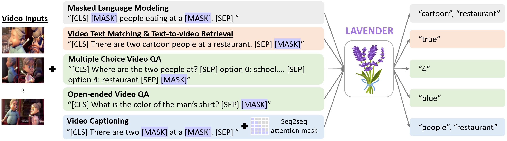

# [CVPR 2023] LAVENDER: Unifying Video-Language Understanding as Masked Language Modeling
[Paper](https://openaccess.thecvf.com/content/CVPR2023/papers/Li_LAVENDER_Unifying_Video-Language_Understanding_As_Masked_Language_Modeling_CVPR_2023_paper.pdf) | [Slide](https://datarelease.blob.core.windows.net/lavender/LAVENDER_CVPR2023_slides.pdf) | [Poster](https://datarelease.blob.core.windows.net/lavender/cvpr23_poster.png) | [Video](https://youtu.be/f8scI82_caE)



This repo is the offcial implementation of CVPR 2023 paper <br>
"[LAVENDER: Unifying Video-Language Understanding as Masked Language Modeling](https://openaccess.thecvf.com/content/CVPR2023/papers/Li_LAVENDER_Unifying_Video-Language_Understanding_As_Masked_Language_Modeling_CVPR_2023_paper.pdf)" <br>
[Linjie Li](https://scholar.google.com/citations?user=WR875gYAAAAJ), [Zhe Gan](https://zhegan27.github.io), [Kevin Lin](https://sites.google.com/site/kevinlin311tw/me), [Chung-Ching Lin](https://www.microsoft.com/en-us/research/people/chunglin/), [Zicheng Liu](https://scholar.google.com/citations?user=bkALdvsAAAAJ), [Ce Liu](https://www.linkedin.com/in/ce-liu-5697501a/) and [Lijuan Wang](https://scholar.google.com/citations?user=cDcWXuIAAAAJ)

We explore a **unified** video-language framework LAVENDER, where **Masked Language Modeling (MLM) is used as the common interface for all pre-training and downstream tasks**. Such unification leads to a simplified model architecture, where only a *lightweight MLM head*, instead of a decoder with much more parameters, is needed on top of the multimodal encoder. Surprisingly, experimental results show that this unified framework achieves competitive performance on 14 VidL benchmarks, covering video question answering, text-to-video retrieval and video captioning. Extensive analyses further demonstrate LAVENDER can
- Seamlessly support all downstream tasks with just a single set of parameter values when multi-task finetuned
- Generalize to various downstream tasks with limited training samples
- Enable zero-shot evaluation on video question answering tasks

## Table of contents
* [Requirements](#Requirements)
* [Data preprocessing](#Data-preprocessing)
* [Pretraining](#Pretraining)
* [Downstream](#Downstream)
* [Multi-task Training](#Multi-task-Training)
* [Citation](#Citation)
* [License](#License)

## Requirements
This code is largely based on the [official pytorch implementation of VIOLET](https://github.com/tsujuifu/pytorch_violet), implemented under **Python 3.8**, [PyTorch 1.7](https://pypi.org/project/torch/1.7.0), and [Torchvision 0.8](https://pypi.org/project/torchvision/0.8.0).
+ [av](https://pypi.org/project/av), + [tqdm](https://pypi.org/project/tqdm), [scikit-image](https://pypi.org/project/scikit-image), [cv2](https://pypi.org/project/opencv-python)
+ [Transformers](https://pypi.org/project/transformers), [FairScale](https://pypi.org/project/fairscale)
+ [DeepSpeed](https://pypi.org/project/deepspeed)


## Data preprocessing
*Copied from [VIOLET](https://github.com/tsujuifu/pytorch_violet)*

As using outer datasets (cannot be shared by us), we provide [preprocessing tools](https://github.com/tsujuifu/pytorch_violet/tree/main/_tools) to extract **sparse-sampled video frames** into our compressed format.
```
cd _tools

# We use 5 frames for both pre-training and downstream tasks
python extract_video-frame.py --path=msrvtt --sample=5 # output: msrvtt.pkl

# We adopt file.seek() instead of loading entire data to reduce the memory cost during distributed pretraining
python extract_tsv.py --path=msrvtt # output: msrvtt.tsv, msrvtt.lineidx
```
There are [partial examples](https://github.com/tsujuifu/pytorch_violet/tree/main/_data) (WebVid2.5M, CC3M, TGIF-Action, MSVD-QA, and MSRVTT-Retrieval) to help formulate the input data.

## Pretraining
- Visit [Video Swin Transformer](https://github.com/SwinTransformer/Video-Swin-Transformer) to download pre-trained weights models. Place  `swin_base_patch244_window877_kinetics*_22k.pth` under `${REPO_DIR}/_models/video_swin_transformer` directory. The data structure should follow the hierarchy below.
    ```
    ${REPO_DIR}  
    |-- _models  
    |   |-- video_swin_transformer
    |    |   |-- swin_base_patch244_window877_kinetics600_22k.pth
    |    |   |-- swin_base_patch244_window877_kinetics400_22k.pth
    |-- _args 
    |-- _datasets
    |-- _imgs 
    |-- ... 
    |-- ... 
    ```
- Download [pretraining datasets](https://drive.google.com/drive/u/0/folders/1PCFBPaIS_2UhFsv7n9L5CYS1wg_dfQF2) ([WebVid2.5M](https://m-bain.github.io/webvid-dataset) & [CC3M](https://github.com/google-research-datasets/conceptual-captions)) provided by VIOLET to `./_datasets`. The data structure should follow the hierarchy below.
    ```
    ${REPO_DIR}  
    |-- _models 
    |-- _args 
    |-- _datasets
    |   |-- txt_webvid2.5.json
    |   |-- webvid2.5_val.tsv
    |   |-- webvid2.5_val.lineidx
    |   |-- webvid2.5_train_1.tsv
    |   |-- webvid2.5_train_1.lineidx
    |   |-- ...
    |   |-- webvid2.5_train_9.tsv
    |   |-- webvid2.5_train_9.lineidx
    |   |-- txt_cc3m.json
    |   |-- cc3m_val.tsv
    |   |-- cc3m_val.lineidx
    |   |-- cc3m_train_1.tsv
    |   |-- cc3m_train_1.lineidx
    |   |-- ...
    |   |-- cc3m_train_9.tsv
    |   |-- cc3m_train_9.lineidx
    |-- _imgs 
    |-- ... 
    |-- ... 
    ```
- Pretrain via **single-node multi-gpu** distributed training.

### **Task-specific Baseline**: Pre-training with Video-Text Matching (VTM) + MLM
```
CUDA_VISIBLE_DEVICES='0,1,2,3,4,5,6,7' python -m torch.distributed.launch --nproc_per_node=8 --master_port=5566 main_pretrain_mlm.py --config _args/args_pretrain.json --path_output _snapshot
```
- Pretrained checkpoint on WebVid2.5M+CC3M: [link](https://datarelease.blob.core.windows.net/lavender/pretrained_ckpt/task-specific.pt)

### **LAVENDER**: Unified Pre-training with VTM as MLM + MLM
```
CUDA_VISIBLE_DEVICES='0,1,2,3,4,5,6,7' python -m torch.distributed.launch --nproc_per_node=8 --master_port=5566 main_pretrain_mlm.py --config _args/args_pretrain.json --path_output _snapshot
```
- Pretrained checkpoint on WebVid2.5M+CC3M: [link](https://datarelease.blob.core.windows.net/lavender/pretrained_ckpt/lavender.pt)
- Scale-up pre-trained checkpoint with 14M videos + 16M images: [link](https://datarelease.blob.core.windows.net/lavender/pretrained_ckpt/lavender_scale_up_pretrain.pt)


## Downstream
Download [downstream datasets](https://drive.google.com/drive/u/1/folders/1wtOsfrSFkGc4kdLQIwOWCEw6gS4aZSvv) to `./_datasets`.

### Multiple-Choice Question Answering 
+ [TGIF-Action](https://github.com/YunseokJANG/tgif-qa)
    ```
    CUDA_VISIBLE_DEVICES='0,1,2,3' python -m torch.distributed.launch --nproc_per_node=4 --master_port=5566 main_qamc_mlm_gen_ans_idx.py --config _args/args_tgif-action.json --path_output _snapshot --path_ckpt <path to downloaded pre-trained weights>
    ```
+ [TGIF-Transition](https://github.com/YunseokJANG/tgif-qa)
    ```
    CUDA_VISIBLE_DEVICES='0,1,2,3' python -m torch.distributed.launch --nproc_per_node=4 --master_port=5566 main_qamc_mlm_gen_ans_idx.py --config _args/args_tgif-transition.json --path_output _snapshot --path_ckpt <path to downloaded pre-trained weights>
    ```
+ [MSRVTT-MC](https://github.com/albanie/collaborative-experts/tree/master/misc/datasets/msrvtt)
    ```
    CUDA_VISIBLE_DEVICES='0,1,2,3' python -m torch.distributed.launch --nproc_per_node=4 --master_port=5566 main_retmc_mlm_head.py --config _args/args_msrvtt-mc.json --path_output _snapshot --path_ckpt <path to downloaded pre-trained weights>
    ```
+ [LSMDC-MC](https://github.com/yj-yu/lsmdc)
    ```
    CUDA_VISIBLE_DEVICES='0,1,2,3' python -m torch.distributed.launch --nproc_per_node=4 --master_port=5566 main_retmc_mlm_head.py --config _args/args_lsmdc-mc.json --path_output _snapshot --path_ckpt <path to downloaded pre-trained weights>
    ```
For task-specific baseline, update the main script to `main_qamc_task_specific.py` or `main_retmc_task_specific.py`, and point ``--path_ckpt`` to pre-trained task-specific baseline.

### Open-Ended Question Answering 
+ [TGIF-Frame](https://github.com/YunseokJANG/tgif-qa)
    ```
    CUDA_VISIBLE_DEVICES='0,1,2,3' python -m torch.distributed.launch --nproc_per_node=4 --master_port=5566 main_qaoe_mlm.py --config _args/args_tgif-frame.json --path_output _snapshot --path_ckpt <path to downloaded pre-trained weights>
    ```
+ [MSRVTT-QA](https://github.com/xudejing/video-question-answering)
    ```
    CUDA_VISIBLE_DEVICES='0,1,2,3' python -m torch.distributed.launch --nproc_per_node=4 --master_port=5566 main_qaoe_mlm.py --config _args/args_msrvtt-qa.json --path_output _snapshot --path_ckpt <path to downloaded pre-trained weights>
    ```
+ [MSVD-QA](https://github.com/xudejing/video-question-answering)
    ```
    CUDA_VISIBLE_DEVICES='0,1,2,3' python -m torch.distributed.launch --nproc_per_node=4 --master_port=5566 main_qaoe_mlm.py --config _args/args_msvd-qa.json --path_output _snapshot --path_ckpt <path to downloaded pre-trained weights>
    ```
+ [LSMDC-FiB](https://github.com/yj-yu/lsmdc)
    ```
    CUDA_VISIBLE_DEVICES='0,1,2,3' python -m torch.distributed.launch --nproc_per_node=4 --master_port=5566 main_qaoe_mlm_lsmdc_fib.py --config _args/args_lsmdc-fib.json --path_output _snapshot --path_ckpt <path to downloaded pre-trained weights>
    ```
For task-specific baseline, update the main script to `main_qaoe_task_specific.py`, and point ``--path_ckpt`` to pre-trained task-specific baseline.

### Text-to-Video Retrieval
+ [MSRVTT](https://github.com/albanie/collaborative-experts/tree/master/misc/datasets/msrvtt)
    ```
    CUDA_VISIBLE_DEVICES='0,1,2,3' python -m torch.distributed.launch --nproc_per_node=4 --master_port=5566 main_retrieval_tsv.py --config _args/args_msrvtt-retrieval.json --path_output _snapshot --path_ckpt <path to downloaded pre-trained weights>
    CUDA_VISIBLE_DEVICES='0,1,2,3' python eval_retrieval_tsv.py --config _args/args_msrvtt-retrieval.json --path_ckpt <path to the finetuned msrvtt-retrieval model ckpt>
    ```
+ [DiDeMo](https://github.com/LisaAnne/TemporalLanguageRelease)
    ```
    CUDA_VISIBLE_DEVICES='0,1,2,3' python -m torch.distributed.launch --nproc_per_node=4 --master_port=5566 main_retrieval_tsv.py --config _args/args_lsmdc-retrieval.json --path_output _snapshot --path_ckpt <path to downloaded pre-trained weights>
    CUDA_VISIBLE_DEVICES='0,1,2,3' python eval_retrieval_tsv.py --config _args/args_lsmdc-retrieval.json --path_ckpt <path to the finetuned lsmdc-retrieval model ckpt>
    ```
+ [MSVD](https://github.com/albanie/collaborative-experts/tree/master/misc/datasets/msrvtt)
    ```
    CUDA_VISIBLE_DEVICES='0,1,2,3' python -m torch.distributed.launch --nproc_per_node=4 --master_port=5566 main_retrieval_tsv.py --config _args/args_msvd-retrieval.json --path_output _snapshot --path_ckpt <path to downloaded pre-trained weights>
    CUDA_VISIBLE_DEVICES='0,1,2,3' python eval_retrieval_tsv.py --config _args/args_msvd-retrieval.json --path_ckpt <path to the finetuned msvd-retrieval model ckpt>
    ```
+ [LSMDC](https://github.com/yj-yu/lsmdc)
    ```
    CUDA_VISIBLE_DEVICES='0,1,2,3' python -m torch.distributed.launch --nproc_per_node=4 --master_port=5566 main_retrieval_tsv.py --config _args/args_lsmdc-retrieval.json --path_output _snapshot --path_ckpt <path to downloaded pre-trained weights>
    CUDA_VISIBLE_DEVICES='0,1,2,3' python eval_retrieval_tsv.py --config _args/args_lsmdc-retrieval.json --path_ckpt <path to the finetuned lsmdc-retrieval model ckpt>
    ```
    
For task-specific baseline, update the main script to `main_retrieval_task_specific.py` or `eval_retrieval_task_specific.py`, and point ``--path_ckpt`` to task-specific checkpoints.

### Video Captioning (MSRVTT, MSVD)
Finetuning on video captioning requires additional enviroment and dataset setup. We closely follow the instructions from [SwinBERT](https://github.com/microsoft/SwinBERT). Please check their repo for more details. 

Note that the data folder should have the following structure:
```
${REPO_DIR}  
    |-- _datasets  
    |   |-- MSRVTT-v2  
    |   |   |-- *.yaml 
    |   |   |-- *.tsv  
    |   |-- MSVD  
    |   |   |-- *.yaml 
    |   |   |-- *.tsv  
    |-- ... 
    |-- ... 
```

Once the docker enviroment and the dataset has been setup correctly, run the following command for training. 

+ MSRVTT
    ```
    CUDA_VISIBLE_DEVICES='0,1,2,3' python -m torch.distributed.launch --nproc_per_node=4 --master_port=5566 main_caption.py --config _args/args_msrvtt-cap.json --path_output _snapshot --path_ckpt <path to downloaded pre-trained weights>
    ```
+ MSVD
    ```
    CUDA_VISIBLE_DEVICES='0,1,2,3' python -m torch.distributed.launch --nproc_per_node=4 --master_port=5566 main_caption.py --config _args/args_msvd-cap.json --path_output _snapshot --path_ckpt <path to downloaded pre-trained weights>
    ```
For task-specific baseline, simply update ``--path_ckpt`` to task-specific pre-trained weights.

## Multi-task Training
### Data Filtering
As mentioned in our paper, the testing splits of all above tasks may overlap. We perform a data filtering step first to remove the testing data of a task from the training data of other tasks. 
```
python _tools/multi_task_vid_filter.py --dataset lsmdc

python _tools/multi_task_vid_filter.py --dataset msrvtt

python _tools/multi_task_vid_filter.py --dataset msvd 

python _tools/multi_task_vid_filter.py --dataset tgif
```
### Training

```
CUDA_VISIBLE_DEVICES='0,1,2,3,5,6,7' python -m torch.distributed.launch --nproc_per_node=8 --master_port=5566 main_multi_task_mlm.py --config _args/args_multi-task_all.json --path_output _snapshot --path_ckpt <path to downloaded pre-trained weights>
```

For task-specific baseline, update the main script to `main_multi_task_multi_head.py` and point ``--path_ckpt`` to task-specific pre-trained weights.

## Citation
If you find this code useful, please consider citing the following papers:
```
@inproceedings{li2023lavender, 
  author = {Linjie Li and Zhe Gan and Kevin Lin and Chung-Ching Lin and Ce Liu and Zicheng Liu and Lijuan Wang}, 
  title = {LAVENDER: Unifying Video-Language Understanding as Masked Language Modeling}, 
  booktitle = {Conference on Computer Vision and Pattern Recognition (CVPR)}, 
  year = {2023} 
}
```
```
@inproceedings{fu2021violet, 
  author = {Tsu-Jui Fu and Linjie Li and Zhe Gan and Kevin Lin and William Yang Wang and Lijuan Wang and Zicheng Liu}, 
  title = {VIOLET: End-to-End Video-Language Transformers with Masked Visual-token Modeling}, 
  booktitle = {arXiv:2111.1268}, 
  year = {2021} 
}
```

## License

Our research code is released under MIT license.

## Contributing

This project welcomes contributions and suggestions.  Most contributions require you to agree to a
Contributor License Agreement (CLA) declaring that you have the right to, and actually do, grant us
the rights to use your contribution. For details, visit https://cla.opensource.microsoft.com.

When you submit a pull request, a CLA bot will automatically determine whether you need to provide
a CLA and decorate the PR appropriately (e.g., status check, comment). Simply follow the instructions
provided by the bot. You will only need to do this once across all repos using our CLA.

This project has adopted the [Microsoft Open Source Code of Conduct](https://opensource.microsoft.com/codeofconduct/).
For more information see the [Code of Conduct FAQ](https://opensource.microsoft.com/codeofconduct/faq/) or
contact [opencode@microsoft.com](mailto:opencode@microsoft.com) with any additional questions or comments.

## Trademarks

This project may contain trademarks or logos for projects, products, or services. Authorized use of Microsoft 
trademarks or logos is subject to and must follow 
[Microsoft's Trademark & Brand Guidelines](https://www.microsoft.com/en-us/legal/intellectualproperty/trademarks/usage/general).
Use of Microsoft trademarks or logos in modified versions of this project must not cause confusion or imply Microsoft sponsorship.
Any use of third-party trademarks or logos are subject to those third-party's policies.

